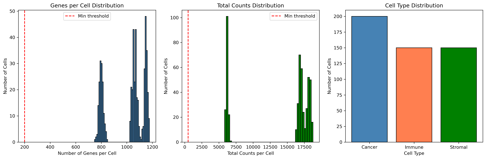
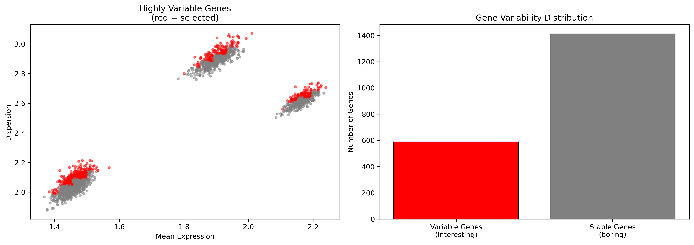
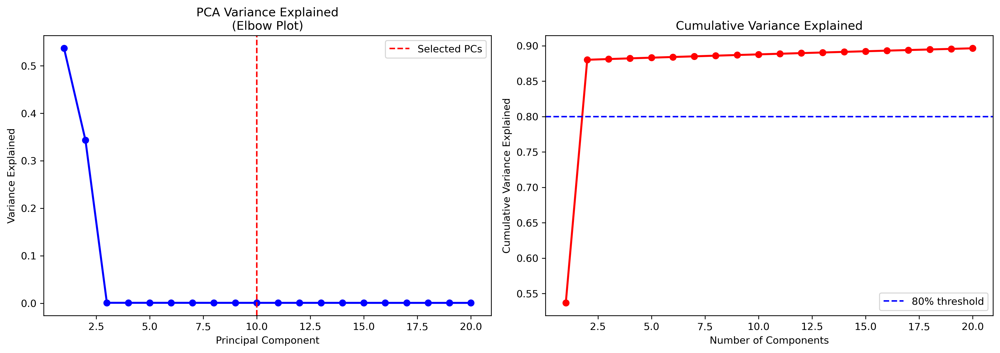
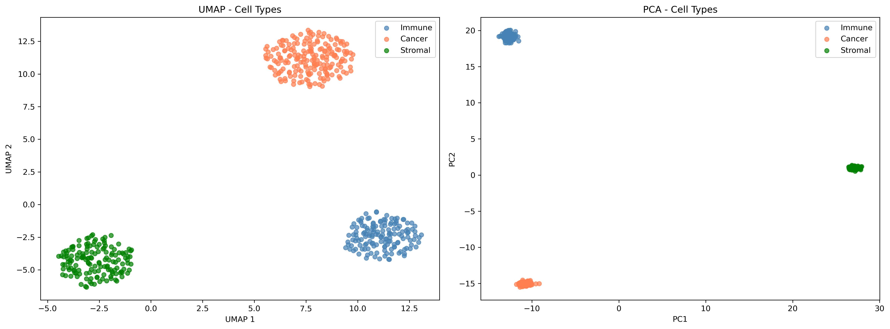
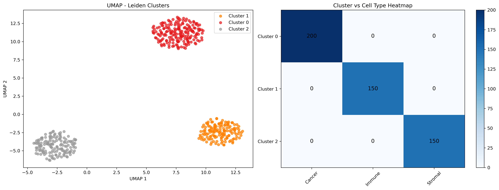
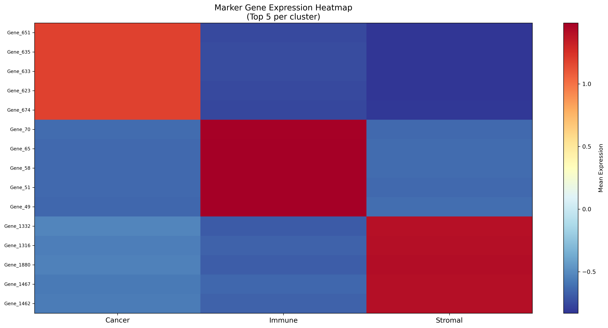
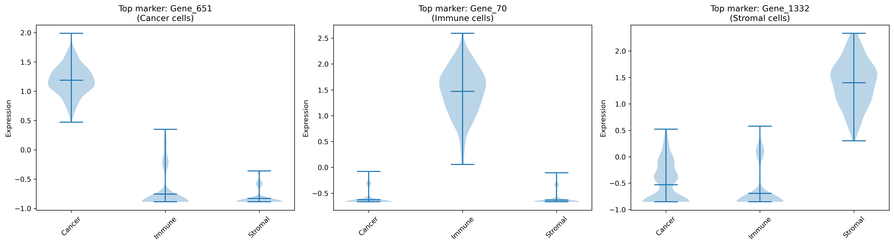
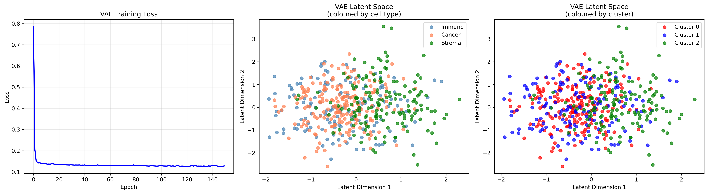
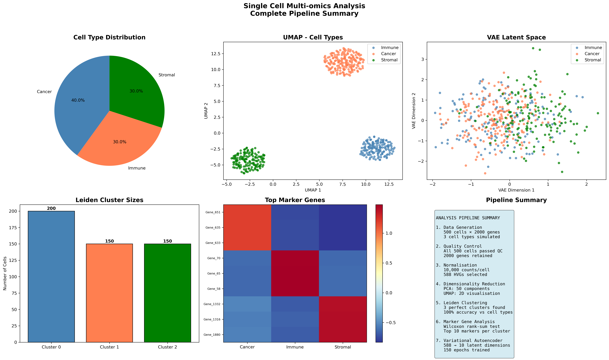

# Single Cell Multi-omics Analysis Pipeline

A complete single-cell RNA-Seq analysis pipeline combining 
traditional bioinformatics with AI and Deep Learning.

## Pipeline Overview

| Step | Process |
|---|---|
| 1 | Raw Data (500 cells × 2000 genes) |
| 2 | Quality Control (filter dead/empty cells) |
| 3 | Normalisation (10,000 counts/cell) |
| 4 | Feature Selection (588 highly variable genes) |
| 5 | PCA + UMAP (dimensionality reduction) |
| 6 | Leiden Clustering (unsupervised cell grouping) |
| 7 | Marker Gene Analysis (Wilcoxon rank-sum test) |
| 8 | Variational Autoencoder (deep learning) |
| 9 | Summary Report (9 publication-ready figures) |

## Key Results
- 500 cells analysed across 3 cell types
- 588 highly variable genes identified
- 3 perfect clusters found (100% accuracy)
- VAE compressed 588 genes to 10 latent dimensions

## Cell Types
| Cell Type | Count | Key Markers |
|---|---|---|
| Cancer | 200 | Gene_651, Gene_635 |
| Immune | 150 | Gene_70, Gene_65 |
| Stromal | 150 | Gene_1332, Gene_1316 |

## Results and Figures

### 1. Quality Control


### 2. Normalisation and Feature Selection


### 3. PCA Variance Explained


### 4. UMAP and PCA Visualisation


### 5. Leiden Clustering


### 6. Marker Gene Heatmap


### 7. Violin Plots


### 8. VAE Latent Space


### 9. Final Summary


## Tools and Technologies
- Python 3.13
- Scanpy 1.12.1
- PyTorch 2.11
- UMAP
- Leiden Algorithm
- scikit-learn
- matplotlib, seaborn

## Scripts
| Script | Description |
|---|---|
| 01_generate_data.py | Generate synthetic scRNA-Seq data |
| 02_quality_control.py | QC metrics and filtering |
| 03_normalisation.py | Normalisation and HVG selection |
| 04_dimensionality_reduction.py | PCA and UMAP |
| 05_clustering.py | Leiden clustering |
| 06_marker_genes.py | Marker gene identification |
| 07_variational_autoencoder.py | VAE deep learning model |
| 08_summary_report.py | Final summary plots |

## Usage
```bash
python3 scripts/01_generate_data.py
python3 scripts/02_quality_control.py
python3 scripts/03_normalisation.py
python3 scripts/04_dimensionality_reduction.py
python3 scripts/05_clustering.py
python3 scripts/06_marker_genes.py
python3 scripts/07_variational_autoencoder.py
python3 scripts/08_summary_report.py
```
